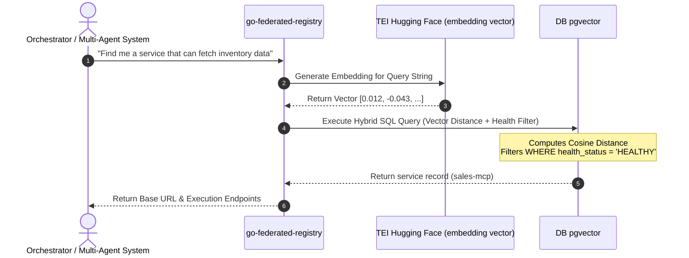
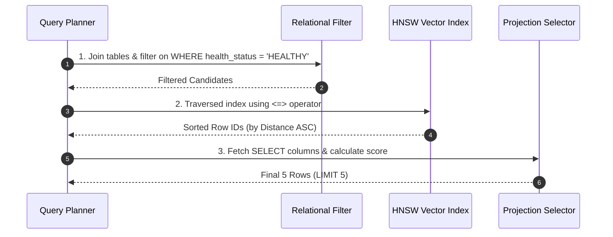

# go-federated-registry
go-federated-registry

## Helper

```sh
tr -d '[],' < v1.txt | xargs
tr -d '[],' < v2.txt | xargs | tr ' ' ','
```

## Diagram





## To do

1. Evaluate a HNSW index

select 	sr.id,
		sr.base_transport, 
		sr.health_status,
		se.url
from 	service_registry sr,
		service_endpoints se,
		service_vectors sv
where 	se.fk_service_registry_id = sr.id
and 	sv.search_vector <=> '[-0.010023851,0.0028419404,...]'
limit 5; 
