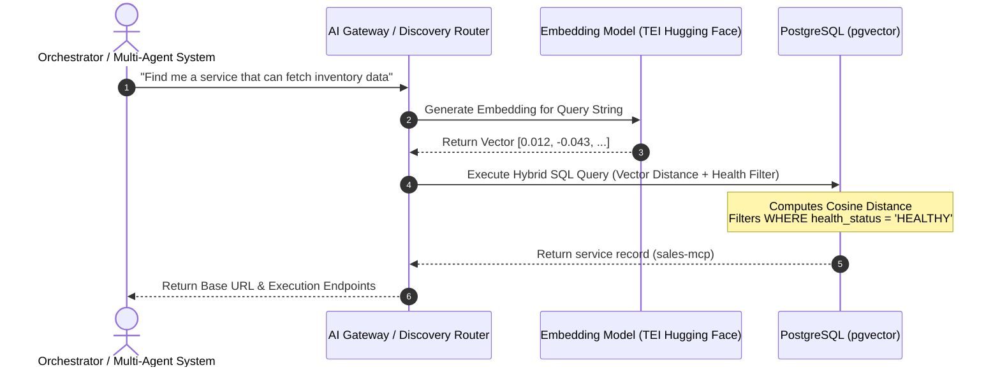

# go-federated-registry-service
go-federated-registry-service

## Helper

tr -d '[],' < v1.txt | xargs
tr -d '[],' < v2.txt | xargs | tr ' ' ','

## Diagram

```mermaid
sequenceDiagram
    autonumber
    actor Client as Orchestrator / Multi-Agent System
    participant GW as AI Gateway / Discovery Router
    participant LLM as Embedding Model (TEI Hugging Face)
    participant DB as PostgreSQL (pgvector)
    
    Client->>GW: "Find me a service that can fetch inventory data"
    GW->>LLM: Generate Embedding for Query String
    LLM-->>GW: Return Vector [0.012, -0.043, ...]
    GW->>DB: Execute Hybrid SQL Query (Vector Distance + Health Filter)
    Note over DB: Computes Cosine Distance<br/>Filters WHERE health_status = 'HEALTHY'
    DB-->>GW: Return service record (sales-mcp)
    GW-->>Client: Return Base URL & Execution Endpoints
```